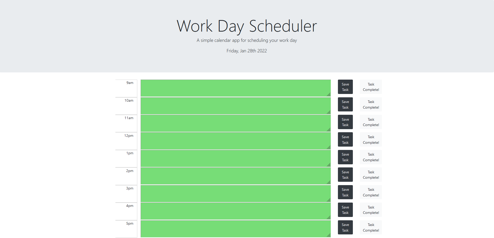

# work-day-scheduler

* This app lets you create a daily work schedule and remind yourself of tasks hourly. It is color coded to better help you know where you are at throughout the day. Previous hours are in grey, current hour is in red, and future hours are in green. You can save tasks that you wish too complete by hitting the save task button. This action will save that information to your local storage, allowing you to close out of the window, return to it later and all of your information will remain there. There is also a task complete button. When clicked it will clear that hour of any and ALL tasks you have written, so press with caution. The app also clears itself for you at the start of each new day. 

https://b-e-christensen.github.io/work-day-scheduler/